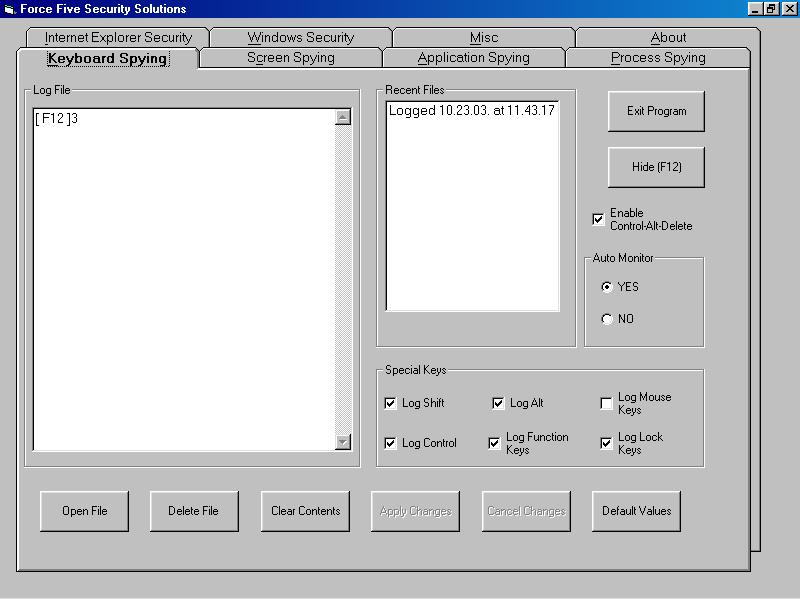



## Computer Monioring

### Description

Spying Software:

Spyware is becoming more sophisticated in today's digital age. Some of these applications have the ability to be remotely installed without the need of physical access to your computer. Others have the ability to monitor your chat transcripts, email usage, and internet connection in a complete stealth environment. There are many other powerful features these Spyware applications offer. To name a few: Remote Access, Critical System Information, Remote Desktop Viewing, Webcam Capturing, Keystroke Logging, Application Usage etc.

This software does the following task

1.	Key Stroke Logger

2.	Screen Shots Logger

3.	Active Application Logger

4.	Shows Currently Running Processes.

5.	Options for Securing Windows and Internet Explorer.

This software remains in stealth mode except for the first time it is running. The shortcut key assigned to it is F12 which can toggle the state of the program from visible to invisible. There is no freely available software of this type in the market. All comes with the heavy price tags along with them. Also companies horrifies user that these software’s are impossible to develop at personal level.

1.	Key Stroke Logger: In key stroke logger records every key stroke generated by the user and stored at the installation path in separate folder. It records all the keys.

2.	Screen Shot Logger: It takes the screen shots at the given interval of time supplied by the user. The image is stored as above in bmp format.

3.	Active Application Logger: It captures each application name which runs on the system and recorded in the log file.

4.	Showing Currently Running Processes. : It shows even those applications which are impossible to see in the Windows 98 environment e.g. kernel32 and so on…

5.	Securing Windows And I.E.: Normally we see the professional software’s which restrict windows environment by some way or another.One can secure by disabling common but important features so that any other user just can’t change the settings of windows environment intentionally or accidentally which may even cause system crash. The other important feature is to clear CMOS password without even removing the CMOS battery. It also removes content rating password also which is helpful if one forgets these passwords.
 
### More Info
 

             |
---                |---
**Submitted On**   |2004-03-12 12:28:44
**By**             |[Soundlesslove](https://github.com/Planet-Source-Code/PSCIndex/blob/master/ByAuthor/soundlesslove.md)
**Level**          |Advanced
**User Rating**    |4.8 (53 globes from 11 users)
**Compatibility**  |VB 6\.0
**Category**       |[Complete Applications](https://github.com/Planet-Source-Code/PSCIndex/blob/master/ByCategory/complete-applications__1-27.md)
**World**          |[Visual Basic](https://github.com/Planet-Source-Code/PSCIndex/blob/master/ByWorld/visual-basic.md)
**Archive File**   |[Computer\_M1865563172005\.zip](https://github.com/Planet-Source-Code/soundlesslove-computer-monioring__1-59521/archive/master.zip)

